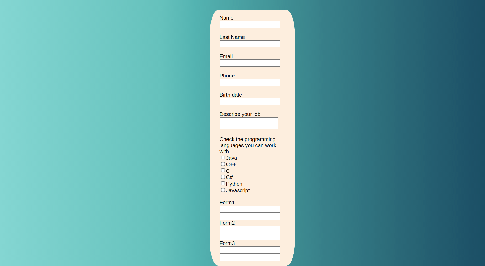
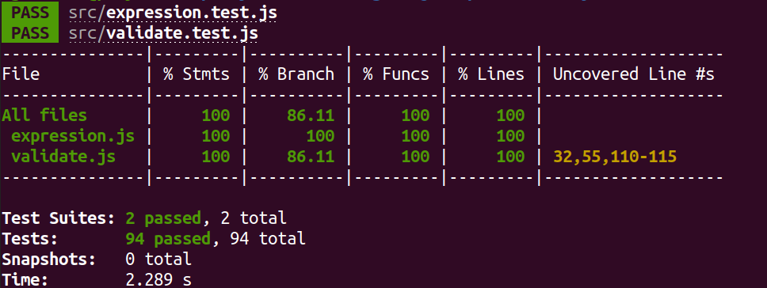

# Validate-a-form-using-js-modules

This is a basic js library that validates the different inputs of a form such as: texts, numbers, dates, checkboxes and text areas.
A useful example of the implementation can be found in the index.html file.

